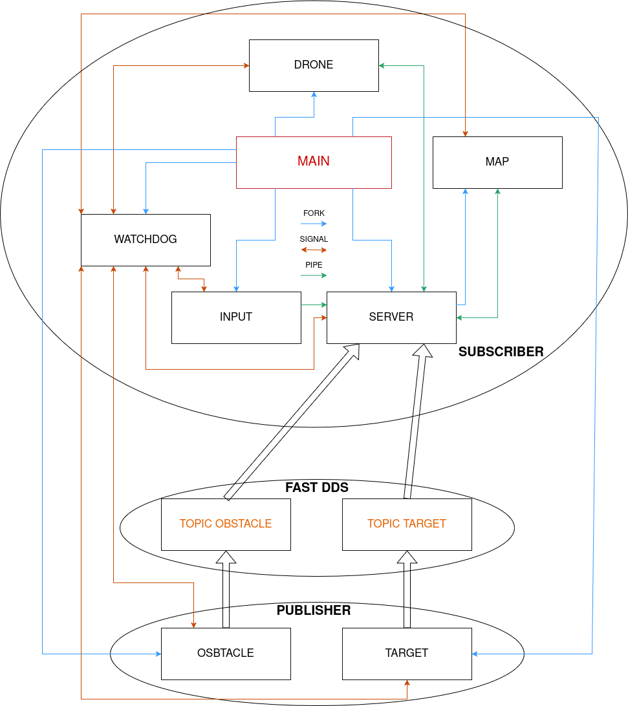

# Assignment 2

The project consists of a 2D simulator for the movement of a drone, designed to account for all the forces acting on a rigid body during real motion according to the Dynamics law. The simulator is structured in a modular way, dividing the various functionalities into active components that communicate with each other through shared memory, pipes, and signals. The project has been developed according to the POSIX standard, and the windows have been implemented using the ncurses library, along with a macro for managing log messages generated by processes and a watchdog that monitors the state of the processes.  

Since the POSIX standard does not provide a native publisher/subscriber communication method, the real-time middleware library Fast DDS was adopted to address this limitation. Two publishers, named `target` and `obstacle`, publish messages on their respective topics using the following common IDL structure:

```idl
struct Objects {
    sequence<long> x;
    sequence<long> y;
    long number_of_objects;
};
```
Here, the first variable (`x`) is an array representing the x-coordinates of targets/obstacles, the second (`y`) is an array representing their y-coordinates, and the third variable (`number_of_objects`) indicates the total number of generated objects. The server from the first assignment now acts as a subscriber, subscribing to both topics to receive updates from the publishers. This enables real-time adjustments to object positions on the map based on the incoming data.  

The drone's dynamics include the attractive force generated by the targets and the repulsive force generated by the obstacles. The goal of the project is to control the drone using keyboard inputs and collect as many targets as possible by flying over them. If the drone collides with an obstacle, the repulsive force from the Latombe's model will be applied.


## Usage


https://github.com/user-attachments/assets/9b8f2c6b-6402-4e13-b846-d3290a49dccc


As seen in the video, the goal is to collect as many targets as possible while avoiding obstacles, as you will be repelled if you hit them. To increase the difficulty, you can adjust the number of obstacles and targets generated in the settings within the JSON file, or even change the frequency at which the objects are generated, all within the same configuration file. There is **NO need to recompile** the code after modifying any of these parameters.  
All commands sent to the drone must be entered through the konsole terminal's input, `keyboard_manager`. To do so, you need to select the terminal window with the mouse cursor, otherwise, no commands will be registered. To end the game, simply press the `P` key, and all tabs and processes will terminate. As shown in the terminal where the main process was launched, it will display all terminated processes along with their respective PIDs.  

**It may happen that, immediately after the components connect, only targets or only obstacles are generated during the first iteration. This is normal when working on slower systems. Starting from the second generation, the system resumes its regular operation, publishing both targets and obstacles correctly and in a synchronized manner.**  

**The Konsole terminal has been replaced with xterm because the former does not support resizing via command. As a result, it was not possible to spawn a Konsole terminal with specific dimensions, whereas this is possible with xterm.**

The game simulates a robot in an artificial environment, but it could easily be translated into the real world, where obstacles could be trees or other objects that, when hit, generate a repulsive force. The targets could represent a designated path the drone is set to follow.

## Repository structure

```
.
├── cJSON
│   └── cJSON.h                            # cJSON library used for JSON parsing and handling configuration file (`appsettings.json`)
├── appsettings.json                       # Contains configuration settings for the application
├── drone.c                                # Component for managing the drone's dynamics
├── .gitignore                             # Ignore the files that should not be added to the repository
├── helper.h                               # Header file with helper function declarations and shared definitions
├── keyboard_manager.c                     # Component for managing user choices
├── launchFile.sh                          # Ignore the files that should not be added to the repository
├── main.c                                 # Component for launching the application
├── map_window.c                           # Component for managing the visualization of all elements
├── README.md                              # File for the repository description
├── src                                    # Folder containing DDS files
│   ├── Binary                             # Folder containing binaries file
│   │   ├── ObstaclePub
│   │   ├── ServerSub
│   │   ├── TargetPub
│   ├── Generated                          # Folder containing autogenerated classes
│   │   ├── ObjectsCdrAux.hpp
│   │   ├── ObjectsCdrAux.ipp
│   │   ├── Objects.hpp
│   │   ├── ObjectsPubSubTypes.cxx
│   │   ├── ObjectsPubSubTypes.hpp
│   │   ├── ObjectsTypeObjectSupport.cxx
│   │   └── ObjectsTypeObjectSupport.hpp
│   ├── Objects.idl                        # Custom message
│   ├── ObstaclePub.cpp                    # Component for generating obstacles 
│   ├── ServerSub.cpp                      # Key component for managing and transmitting data between the various components
│   └── TargetPub.cpp                      # Component for generating targets
├── .vscode                                # VSCode folder for compiling DDS files
│   ├── launch.json
│   ├── settings.json
│   └── tasks.json
└── watchdog.c                             # Component for monitoring the state of the various components
```

## Architecture sketch

The system is organized into a modular architecture where each component is encapsulated in its own source file. The overall flow is as follows:



- **main.c**: the entry point of the application. It uses the primitive `fork()` to create new processes, which then use the other primitive `execvp()` to launch all the necessary processes for the program to function. It manages the creation of pipes, which are passed as arguments to the various components, and also reads configuration parameters from a **JSON file** to send them to the relevant components. Additionally, a **semaphore mechanism** is in place to ensure that even slower systems do not crash the program due to lack of synchronization during the startup. This allows components to sync properly by providing enough time to load one component at a time.
- **ServerSub.cpp**: the server is primarily responsible for collecting and distributing various information among the components. This information is transmitted via unnamed pipes, which are read using the `select()` system call. In addition to pipes, signals are also employed to send messages. Shared memory is used to store data regarding the drone’s position, velocity, force, and the score achieved during the game. Furthermore, the server is responsible for launching the map. Here, a semaphore mechanism is implemented to ensure that the map starts only after all components have been fully loaded, thus preventing fatal errors on slower systems due to synchronization issues. Unlike the prior implementation, the server no longer triggers target/obstacle generation via signals. Instead, components now autonomously handle generation using internal semaphores to synchronize their publishing cycles. This ensures all components begin publishing simultaneously, maintaining strict synchronization. At every `Frequency` interval, the publishers publish updates to their respective topics in such a way that the server reads these messages and forwards them to relevant components.
- **drone.c**: this is the computational component of the project. It receives data on targets and obstacles, map dimensions, and the force applied to the drone, and calculates the movement the drone should perform based on this information. At the same time, it checks and updates the score if the drone's movement successfully reaches a target. In the simulation, obstacles are subjected to a repulsive force calculated using the Latombe/Kathib model, while targets experience an attractive force using the same model. The drone moves according to the laws of dynamics, possessing mass and experiencing viscous friction due to air resistance.
- **keyboard_manager.c**: this component is responsible for receiving user input and forwarding it to the server, which in turn passes it on to the drone. It also implements an interactive ncurses window: the right panel displays information about the drone's position, velocity, and force, while the left panel contains buttons for controlling the drone's movement in various directions. To ensure interactivity and responsiveness, a separate thread runs the process concurrently. Additionally, the component supports dynamic resizing of the ncurses window, adjusting its content seamlessly.
- **map_window.c**: this is the component responsible for rendering the entire simulation using an ncurses resizable window. The display includes the drone (represented by the `+` symbol), obstacles (`O`), targets (`T`), the map borders, and the total score shown at the top. The `SIGWINCH` signal is used to detect when the window is resized. Whenever the map's dimensions change, the new dimensions are sent via a pipe to the server, which then forwards them to the various components.
- **ObstaclePub.cpp**: this component is responsible for generating obstacles with random (`x, y`) positions using the `uniform_int_distribution()` function, while always considering the map's dimensions to ensure that obstacles are not placed outside of it. Obstacle generation occurs each time a signal is received from the server, and the number of obstacles to generate is determined by a value specified in the JSON configuration file. The generated list of obstacles is then sent to the server, which in turn forwards it to the drone and the map. Unlike the previous implementation, the obstacle and target components now synchronize with each other using a semaphore mechanism. This ensures they start publishing messages containing the list of generated objects to their respective topics simultaneously. Every `Frequency` seconds ,as specified by the parameter in the JSON configuration file, these components generate new objects and publish them, maintaining synchronization and consistency across the system.
- **TargetPub.cpp**: this component is responsible for generating targets with random (`x, y`) positions using the `uniform_int_distribution()` function, while always considering the map's dimensions to ensure that targets are not placed outside of it. Unlike the previous implementation, the obstacle and target components now synchronize with each other using a semaphore mechanism. This ensures they start publishing messages containing the list of generated objects to their respective topics simultaneously. Every `Frequency` seconds ,as specified by the parameter in the JSON configuration file, these components generate new objects and publish them, maintaining synchronization and consistency across the system.
- **watchdog.c**: this component monitors the status of all other components. Every `TIMEOUT` seconds, it sends a signal to each process and waits for a response. For each component that replies, a log entry is recorded with the date, time, and corresponding message. If a component fails to respond within the assigned time, the watchdog sends a termination signal to all components and logs an error for the unresponsive component.

## Installation and running instructions

### Prerequisites
- **GCC Compiler**: Ensure that GCC is installed on your system.
- **fastDDS**: Ensure that [fastDDS](https://fast-dds.docs.eprosima.com/en/latest/installation/sources/sources_linux.html) is install on your system.
- **Konsole terminale**: Ensure that Konsole is installed on your system.
   ```bash
   sudo apt install konsole
   ```
- **Xterm terminale**: Ensure that Xterm is installed on your system.
   ```bash
   sudo apt install xterm
   ```
- **NCurses library**: Ensure that NCurses is installed on your system.
   ```bash
   sudo apt install libncurses-dev
   ```
- **cJSON library**: Ensure that cJSON is installed on your system.
   ```bash
   sudo apt install libcjson-dev
   ```

### Building the application

1. **Clone the repository**  
   Open a terminal and run:
   ```bash
   git clone https://github.com/AlessandroMangili/assignment_arp.git
   cd assignment_arp
   ```

2. **Change branch**
   Change the branch:
   ```bash
   git switch assignment 1
   ```


3. **Compile the code**  
   Use the ***launch file*** provided:
   ```bash
   bash launchFile
   ```
   This command will compile the source files and generate all the executables.

### Running the application

After building, run the executable:
```bash
./main
```

## Operational instructions

- **User Input:**  
  Use the keyboard to control the drone. The `input` maps keystrokes to drone commands.
  
  ### **KEYS INSTRUCTIONS**
  
  Below are the available keys and their corresponding actions:
  
  ```
  -------------------------
      | W | E | R | ... | P | 
  -------------------------
        | S | D | F |
     -----------------
         | X | C | V |
     -----------------
  ```
  
  - **W:** Move up-left  
  - **E:** Move up  
  - **R:** Move up-right
  - **S:** Move left  
  - **D:** Remove all forces (drone will continue by inertia)  
  - **F:** Move right  
  - **X:** Move down-left  
  - **C:** Move down  
  - **V:** Move down-right  
  - **P:** Quit the game (terminates the program)
 
- **Connection with others:**
  If you want to generate obstacles and targets as in the first assignment, you need to change the server ID to match that of the publisher and then recompile everything.
  
  ```cpp
    participant_ = DomainParticipantFactory::get_instance()->create_participant(1, participantQos);   # Should be 1 for all your cpp files
  ```
  
  If you want the server to receive obstacles and targets from other PCs, the IDs must be the same, and both devices **must be connected to the same network**.

  ```cpp
    Server
    participant_ = DomainParticipantFactory::get_instance()->create_participant(1, participantQos);   # Your server
  ```

  ```cpp
    Target, Obstacle
    participant_ = DomainParticipantFactory::get_instance()->create_participant(1, participantQos);   # Obstacle and Target of the other pc 
  ```
  
  It is also possible to configure the system so that the target and obstacle components of another PC send objects to my server, and vice versa, allowing my target and obstacle components to send objects to the other PC's server.

  ```cpp
    Server
    participant_ = DomainParticipantFactory::get_instance()->create_participant(1, participantQos);   # The other server should have 2 
  ```

  ```cpp
    Target, Obstacle
    participant_ = DomainParticipantFactory::get_instance()->create_participant(2, participantQos);   # The other obstacle and target should have 1 
  ```

- **Configuration:**  
  The `appsettings.json` file contains several parameters that define the initial setup of the simulation. Here are the key parameters:
  
  ```json
  {
      "NumObstacles": 13,
      "NumTargets": 13,
      "Frequency": 10,
      "MapDimensionX": 110,
      "MapDimensionY": 28,
      "DroneInitialPosition": {
          "Position" : [5.0, 10.0],
          "Velocity" : [0.0, 0.0],
          "Force" : [0.0, 0.0]
      }
  }
  ```
  - **`NumObstacles`**: this parameter defines the number of obstacles to be generated in the simulation.
  - **`NumTargets`**: this parameter sets the number of targets to be generated.
  - **`Frequency`**: this parameter sets the frequency at which the target and obstacle components send the generated objects to the server.
  - **`MapDimensionX`**: this parameter sets the `x` dimension of the map.
  - **`MapDimensionY`**: this parameter sets the `y` dimension of the map.
  - **`DroneInitialPosition`**: this object contains the initial settings for the drone's spawn:
    - **`Position`**: the starting position of the drone in the simulation
    - **`Velocity`**: the initial velocity of the drone
    - **`Force`**: the initial force applied to the drone

- **Header:**
  The `helper.h` file contains several parameters, structures, and a logging routine that define essential behavior and data structures for the program. Here’s a breakdown of the key elements in this header file:

 #### **Constants**
  ```c
  #define BOX_HEIGHT 3                            
  #define BOX_WIDTH 5                           
  #define TIMEOUT 10                             
  #define N_PROCS 5                              
  #define DRONE_SHARED_MEMORY "/drone_memory"    
  #define SCORE_SHARED_MEMORY "/score_memory"     
  #define MASS 2                                 
  #define FRICTION_COEFFICIENT 0.5              
  #define FORCE_MODULE 0.2                     
  #define T 0.5                                
  #define MAX_FREP 15                            
  #define HIT_THR 1.0                            
  ```
  
  - **`BOX_HEIGHT`**: defines the height of the box around each key in the user interface.
  - **`BOX_WIDTH`**: defines the width of the box around each key in the user interface.
  - **`TIMEOUT`**: specifies the number of seconds after which, if a process does not respond, the watchdog will terminate all processes.
  - **`N_PROCS`**: sets the number of processes managed by the watchdog.
  - **`DRONE_SHARED_MEMORY`**: defines the name of the shared memory segment used for storing the drone's data.
  - **`SCORE_SHARED_MEMORY`**: defines the name of the shared memory segment used for storing the score data.
  - **`MASS`**: the mass of the drone, set to `2` kg.
  - **`FRICTION_COEFFICIENT`**: the friction coefficient of the drone.
  - **`FORCE_MODULE`**: the magnitude of the force applied to the drone.
  - **`T`**: the time interval (delta time) used in the simulation.
  - **`MAX_FREP`**: the maximum frequency of repulsion force to be applied.
  - **`HIT_THR`**: the threshold value for detecting a collision when the drone hits an object.

  #### **Structures**

  ```c
   typedef struct {
        float pos_x, pos_y;
        float vel_x, vel_y;
        float force_x, force_y;
        sem_t *sem;
    } Drone;                      
  ```
  
  - **`Drone`**: represents the drone object in the simulation, containing:
    - `pos_x`, `pos_y`: the position of the drone on the map.
    - `vel_x`, `vel_y`: the velocity components of the drone.
    - `force_x`, `force_y`: the force components acting on the drone.
    - `sem`: a semaphore used for synchronizing access to the drone data since shared memory is used.
      
   ```c
    typedef struct {
      int pos_x, pos_y;
      char type;
      bool hit;
    } Object;                  
  ```  
    
  - **`Object`**: represents obstacles or targets in the simulation, containing:
    - `pos_x`, `pos_y`: the position of the object.
    - `type`: specifies whether the object is an obstacle or a target.
    - `hit`: a boolean flag indicating whether the object has been hit by the drone.
      
   ```c
    typedef struct {
      int max_x, max_y;
    } Game;             
  ```  
    
  - **`Game`**: represents the game environment, containing:
    - `max_x`, `max_y`: the boundaries dimension of the game map.

```idl
struct Objects {
    sequence<long> x;       // Dynamic array of x-coordinates
    sequence<long> y;       // Dynamic array of y-coordinates
    long number_of_objects; // Total count of objects
};
```

- **``Topic message``**:  
  The `Objects` struct defines the message format used by the publishers (`target` and `obstacle`) on their respective topics:  
  - **`x`**: A sequence (dynamic array) storing the x-coordinates of targets or obstacles.  
  - **`y`**: A sequence (dynamic array) storing the y-coordinates of targets or obstacles.  
  - **`number_of_objects`**: An integer specifying the total number of objects in the current update.  

  #### **Logging routine**
  ```c
  static inline __attribute__((always_inline)) void writeLog(FILE* file, char* message) {
      char time_now[50];
      time_t log_time = time(NULL);
      strftime(time_now, sizeof(time_now), "%Y-%m-%d %H:%M:%S", localtime(&log_time));
      int lockResult = flock(fileno(file), LOCK_EX);
      if (lockResult == -1) {
          perror("Failed to lock the log file");
          exit(EXIT_FAILURE);
      }
      
      fprintf(file,"[%s] => %s\n", time_now, message);
      fflush(file);
  
      int unlockResult = flock(fileno(file), LOCK_UN);
      if (unlockResult == -1) {
          perror("Failed to unlock the log file");
          exit(EXIT_FAILURE);
      }
  }
  ```
  - **`writeLog()`**: This function writes a log entry to the specified file, including the current timestamp and the provided message. It employs file locking (`flock`) to ensure thread-safe writing to the log file. If the lock cannot be acquired, the program terminates. After the message is written, the lock is released.
  
  ```c
  #define LOG_TO_FILE(file, message) {                                                                                \
      char log[4096];                                                                                                 \
      sprintf(log, "Generated at line [%d] by [%s] with the following message: %s", __LINE__, __FILE__, message);     \
      writeLog(file, log);                                                                                            \
  }
  ```
  - **`LOG_TO_FILE()`**: a macro that generates a detailed log message, including the line number and file name where the log was generated. It then calls the `writeLog()` function to write the log message to the specified file.
 
## Futher information

### Signals

The signals used are as follows: 
- `SIGUSR1` to send a response to the watchdog.
- `SIGUSR2` to terminate the component.
- `SIGWINCH` for window resizing.

The default signal behavior is overridden using the `sigaction()` primitive, while `sigprocmask()` is employed to block all other signals. This ensures that if a component receives an unexpected signal (i.e., one not listed), it can ignore it without any effect. The signal mask is custom for each component based on which signals it needs to receive.

### Primitives

The primitives used in this program are:
- `Pipes` (both named and unnamed)
- `Semaphores`
- `Shared memory`
- `Signals`
- `Fork`
- `Execvp`
- `Publisher/Subscriber` with fastDDS

These primitives enable communication and synchronization between processes, as well as the creation and execution of new processes.

### Limitations

Due to the buffer for sending targets and obstacles being limited to `4096`, only a limited number of obstacles and targets can be generated. Moreover, since there are no checks based on the drone's position or the positions of previously generated objects, it is possible for a target or obstacle to be generated exactly where the drone is located, or for two objects to be generated at the same point.  
Since the server cannot communicate with the target or obstacle components, the map cannot be resized dynamically. Instead, its dimensions must be set in the JSON file. Additionally, when generating objects from components on another PC, both systems must have the same map dimensions. Otherwise, objects will be generated in incorrect positions.  

## Contributors

The people who worked on this project:

- **Alessandro Mangili** - [@AlessandroMangili](https://github.com/AlessandroMangili)
- **Marco Lovecchio** - [@MarcoLovecchio](https://github.com/MarcoLovecchio)