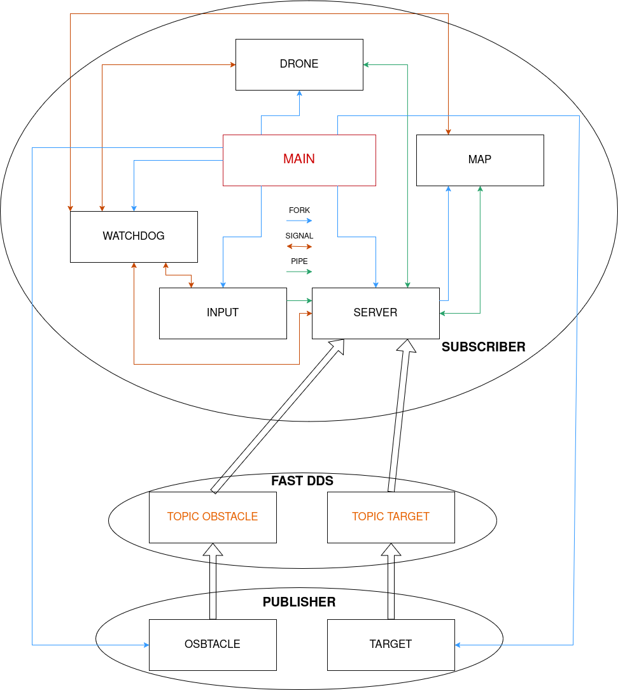

# Assignment1

It is a 2D drone motion simulator designed to account for all the forces acting on a rigid body during real-world motion, including friction.
The simulation environment consists of multiple processes that handle various aspects of drone flight, including potential challenges and complications. These processes communicate by exchanging data through shared memory or pipes, and they all operate as child processes of a central main process.

## Repository Structure
- **`cJSON/`**  
  Contains the cJSON library used for JSON parsing and handling configuration file (`appsettings.json`).
  
- **`appsettings.json`**  
  Contains configuration settings for the application.

- **`launchFile.sh`**  
  A shell script to compile all the files.
  
- **`helper.h`**  
  Header file with helper function declarations and shared definitions.

- **`debug.log`**  
  Stores detailed diagnostic information for debugging and analyzing system behavior.
  
- **`error.log`**  
  Logs errors and critical issues encountered during execution for troubleshooting.

## Architecture Sketch

The system is organized into a modular architecture where each component is encapsulated in its own source file. The overall flow is as follows:



- **main.c**: entry point of the application. It uses `fork()` to create new processes, which then use `execvp()` to launch all the necessary processes for the program to function.
- **server.c**: the blackboard, in addition to launching the process for map management, collects information from all active files via pipes and communicates it to the respective components, thus managing the data exchange. Not only pipes are used, but also shared memory to update the drone's position and the score. Additionally, through signals, every 15 seconds it sends signals to the components to generate new targets and obstacles, requesting them to create new ones.
- **drone.c**: it is the computational component of the project, which receives data regarding input, the map, and objects, and then manages the dynamics of position, velocity, and force to simulate its movement within the map. Additionally, it implements algorithms to detect collisions with obstacles and targets, where a repulsion logic is applied for obstacles, and an attraction logic for targets. The position calculation is based on Newton's second law, considering the sum of all forces.
- **input.c**: is the component that receives the user's action and transmits it to the server, which then forwards it to the drone. Additionally, it implements an interactive ncurses window, where the right side displays information related to the drone's position, velocity, and force, while the left side contains buttons for the various directions in which the drone can be moved. To make the ncurses window interactive and dynamic, a thread is used to run the process in parallel. Furthermore, it includes functionality to resize the ncurses window, dynamically adjusting its content without any issues.
- **map.c**: is the component responsible for rendering the entire environment in the ncurses window, including the drone, obstacles, targets, score, and map boundaries. Additionally, like the input component, it implements a function to resize the window, dynamically updating the content without causing issues, just like with the input.
- **obstacle.c**: is responsible for generating obstacles with random `(x, y)` positions, based on the map's dimensions, every time it receives a signal from the server. It then sends this information to the server, which forwards it to the relevant components.
- **target.c**: is responsible for generating targets with random `(x, y)` positions, based on the map's dimensions, every time it receives a signal from the server. It then sends this information to the server, which forwards it to the relevant components.
- **watchdog.c**: is the component responsible for monitoring the status of the other components. Every `10` seconds, it sends a signal to each process and waits for a response. For each component that responds, a log entry is written with the date, time, and message. If a component does not respond within the time limit, the watchdog sends a termination signal to all other components and logs an error in the error file for the component that did not respond within `10` seconds.

## Installation and Running Instructions

### Prerequisites
- **GCC Compiler**: Ensure that GCC is installed on your system.
- **Konsole terminale**: Ensure that Konsole is installed on your system.
   ```bash
   sudo apt install konsole
   ```
- **NCurses library**: Ensure that NCurses is installed on your system.
   ```bash
   sudo apt install libncurses-dev
   ```
- **cJSON library**: Ensure that cJSON is installed on your system.
   ```bash
   sudo apt install libcjson-dev
   ```

### Building the Application

1. **Clone the Repository**  
   Open a terminal and run:
   ```bash
   git clone https://github.com/AlessandroMangili/assignment_arp.git
   cd assignment_arp
   ```

2. **Compile the Code**  
   Use the LaunchFile provided:
   ```bash
   bash launchfile
   ```
   This command will compile the source files and generate all the executables.

### Running the Application

After building, run the executable:
```bash
./main
```

## Operational Instructions

- **User Input:**  
  Use the keyboard to control the drone. The `input` maps keystrokes to drone commands.
  
  ### **KEYS INSTRUCTIONS**
  
  Below are the available keys and their corresponding actions:
  
  ```
  -------------------------
      | W | E | R | ... | P | 
  -------------------------
        | S | D | F |
     -----------------
         | X | C | V |
     -----------------
  ```
  
  - **E:** Move Up  
  - **C:** Move Down  
  - **S:** Move Left  
  - **F:** Move Right  
  - **R:** Move Up-Right  
  - **W:** Move Up-Left  
  - **V:** Move Down-Right  
  - **X:** Move Down-Left  
  - **D:** Remove All Forces (drone will continue by inertia)  
  - **P:** Quit the Game (terminates the program)

- **Configuration:**  
  The `appsettings.json` file contains several parameters that define the initial setup of the simulation. Here are the key parameters:
  
  ```json
  {
      "NumObstacles": 13,
      "NumTargets": 13,
      "DroneInitialPosition": {
          "Position" : [5.0, 10.0],
          "Velocity" : [0.0, 0.0],
          "Force" : [0.0, 0.0]
      }
  }
  ```
  - **`NumObstacles`**: this parameter defines the number of obstacles to be generated in the simulation.
  - **`NumTargets`**: this parameter sets the number of targets to be generated.
  - **`DroneInitialPosition`**: this object contains the initial settings for the drone's spawn:
    - **`Position`**: the starting position of the drone in the simulation
    - **`Velocity`**: the initial velocity of the drone
    - **`Force`**: the initial force applied to the drone

- **Header:**
  The `helper.h` file contains several parameters, structures, and a logging routine that define essential behavior and data structures for the program. Here’s a breakdown of the key elements in this header file:

  #### **Constants**
  ```c
  #define BOX_HEIGHT 3                            
  #define BOX_WIDTH 5                           
  #define TIMEOUT 10                             
  #define N_PROCS 5                              
  #define DRONE_SHARED_MEMORY "/drone_memory"    
  #define SCORE_SHARED_MEMORY "/score_memory"     
  #define MASS 2                                 
  #define FRICTION_COEFFICIENT 0.5              
  #define FORCE_MODULE 0.2                     
  #define T 0.5                                
  #define MAX_FREP 15                            
  #define HIT_THR 1.0                            
  ```
  
  - **`BOX_HEIGHT`**: defines the height of the box around each key in the user interface.
  - **`BOX_WIDTH`**: defines the width of the box around each key in the user interface.
  - **`TIMEOUT`**: specifies the number of seconds after which, if a process does not respond, the watchdog will terminate all processes.
  - **`N_PROCS`**: sets the number of processes managed by the watchdog.
  - **`DRONE_SHARED_MEMORY`**: defines the name of the shared memory segment used for storing the drone's data.
  - **`SCORE_SHARED_MEMORY`**: defines the name of the shared memory segment used for storing the score data.
  - **`MASS`**: the mass of the drone, set to `2` kg.
  - **`FRICTION_COEFFICIENT`**: the friction coefficient of the drone.
  - **`FORCE_MODULE`**: the magnitude of the force applied to the drone.
  - **`T`**: the time interval (delta time) used in the simulation.
  - **`MAX_FREP`**: the maximum frequency of repulsion force to be applied.
  - **`HIT_THR`**: the threshold value for detecting a collision when the drone hits an object.

  #### **Structures**
  - **`Drone`**: represents the drone object in the simulation, containing:
    - `pos_x`, `pos_y`: the position of the drone on the map.
    - `vel_x`, `vel_y`: the velocity components of the drone.
    - `force_x`, `force_y`: the force components acting on the drone.
    - `sem`: a semaphore used for synchronizing access to the drone data.
    
  - **`Object`**: represents obstacles or targets in the simulation, containing:
    - `pos_x`, `pos_y`: the position of the object.
    - `type`: specifies whether the object is an obstacle or a target.
    - `hit`: a boolean flag indicating whether the object has been hit by the drone.
    
  - **`Game`**: represents the game environment, containing:
    - `max_x`, `max_y`: the maximum boundaries of the game map.

  #### **Logging Routine**
  ```c
  static inline __attribute__((always_inline)) void writeLog(FILE* file, char* message) {
      char time_now[50];
      time_t log_time = time(NULL);
      strftime(time_now, sizeof(time_now), "%Y-%m-%d %H:%M:%S", localtime(&log_time));
      int lockResult = flock(fileno(file), LOCK_EX);
      if (lockResult == -1) {
          perror("Failed to lock the log file");
          exit(EXIT_FAILURE);
      }
      
      fprintf(file,"[%s] => %s\n", time_now, message);
      fflush(file);
  
      int unlockResult = flock(fileno(file), LOCK_UN);
      if (unlockResult == -1) {
          perror("Failed to unlock the log file");
          exit(EXIT_FAILURE);
      }
  }
  ```
  - **`writeLog()`**: this function writes a log entry to the specified file. It includes the current timestamp and the message provided as input. The function uses file locking (`flock`) to ensure thread-safe writing to the log file. If locking fails, it terminates the program. Once the message is written, the lock is released.
  
  ```c
  #define LOG_TO_FILE(file, message) {                                                                                \
      char log[4096];                                                                                                 \
      sprintf(log, "Generated at line [%d] by [%s] with the following message: %s", __LINE__, __FILE__, message);     \
      writeLog(file, log);                                                                                            \
  }
  ```
  - **`LOG_TO_FILE()`**: a macro that generates a detailed log message, including the line number and file name where the log was generated. It then calls the `writeLog()` function to write the log message to the specified file.